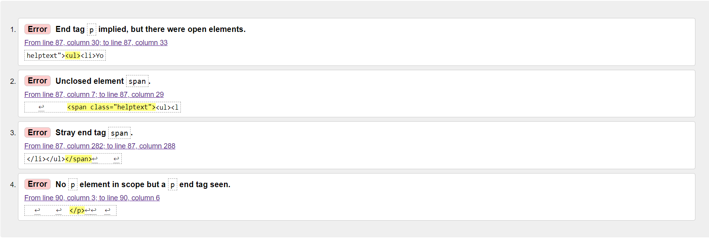

# Oodles of Comfort

## Overview

Oodles of Comfort is a blog which is home to many tasty ramen recipes. Users can browse a huge range of recipes to find the perfect one for them. They can also filter through the recipes should they need more specific recipes i.e vegan recipes.

As well as this users will be able to create an account and log in to the blog, this will allow them to like and add comments to their favourite recipes and create a user profile. 

## Contents

* User Experience
- [Design](#design)
    - [Wireframes](#wireframes)
    - [Site Styling](#site-styling)
    - [Database Design](#database-design)
- [Features](#feature)
- [Languages and Technologies](#languages-and-technologies)
    - [Languages and Frameworks](#languages-and-frameworks)
    - [Packages](#packages)
    - [Tools and Programs Used](#tools-and-programs-used)
- [Testing](#testing)
    - [Code Validation](#code-validation)
    - [Manual Testing](#manual-Testing)
- [Deployment](#deployment)
- [Content](#content)
- [Credits](#credits)

## User Experience

## Design

### Wireframes

#### Desktop

Home

Recipe List

Recipe Post

User Profile

Sign In Design 1

Sign In Design 2

404 Page

#### Mobile

Home Page

Recipe List

Recipe Post

User Profile

404

### Site Styling

#### Colour Scheme

During the initial planning of the overall site design, I had gone with the above colour scheme as it I felt that it would like nice alongside the chosen images for my recipes however on adding the CSS to my index.html page the overall look was difficult to read. 

Due to this, I changed the colour scheme to more softer colours.

##### Final Colour Scheme 

#### Typography

##### Heading Font

For the headings throughout the site I went with the font Madimi One. 

This font suits the overall minimal style of the site. 

##### Content Font

For the overall content of the site I decided to use the font Nunito, this font is quite similar to Madimi One and pairs with it quite well and is legible for the large amount of content with the recipes. 

### Database Design

#### ERD - Entity Relationship Diagram

### Models

#### Recipe Model

#### Recipe Tag Model

#### UserProfile Model

#### Comment Model

#### LikedRecipe Model

## Features

### Navbar

The navbar was created using Bootstrap 5 in order to ensure it would be responsive across various viewports. When a user is not signed in the navbar will display the following:

- Home
- Recipes
- Register
- Login

When the user is signed in the following is instead displayed:

- Home
- Recipes
- My Profile
- Sign Out

#### Desktop - Signed out

#### Desktop - Signed in

#### Mobile non-expanded

#### Mobile expanded

### Footer

The footer for this site is used to contain links to various social media platforms. 

### Home Page

For this site the home page is used to introduce the user to ramen, with a short blurb which emphasises the cosiness of a bowle of ramen and ties in with the name of the site. 

Under this there is a 'Recipes of the day' section, which displays 4 random recipes from the database to the user. This is changed on every refresh of the home page. 

### Recipes List Page

The recipe list page lets the user see all of the recipes that are available on site. From here they can also search for a particular recipe. 

### Recipe Search Page

When a user searches for a particular recipe it is presented to them on a separate page. 

### Recipe Details Page

On this page the user is presented with the name of the recipe, recipe image, ingredients and the necessary steps to create the dish. 

### Comments 

Users are able to comment on any of the recipes, once approved it will be displayed on the page. If a user is logged in and has posted to the page they will see the option to 'Edit' or 'Delete' their comment. 

### User Profile

Here the user can see a page which displays their username, when the account was created and a profile picture. 

In future I would like to display recently liked recipes and a scrollable list of recent comments, further to this an option to upload a profile picture as it is currently only possible through the admin panel. 

### Sign Up

From here if the user does not have an account they may register their account. 

### Sign In

For users that already have an account they can sign in here

### Sign Out

When the user wishes to sign out they are presented with a message to ensure they do want to sign out. 

## Languages and Technologies

### Languages and Frameworks

Throughout the creation of this project the following languages and frameworks were used.

- HTML was used for the markup and templating. 
- Django as the web framework.
- Python was used for all backend work. 
- CSS was used to style the site.
- Bootstrap 5 was used throughout some elements for a responsive framekwork. 

### Packages

The following packages were installed throughout the development. 

| Package Name| Package Description |
| ----------- | ----------- |
| [crispy-bootsrap5](https://github.com/django-crispy-forms/crispy-bootstrap5)     |  This package was used to create a reusable DRY approach to forms.      |
| [Django-allAuth](https://docs.allauth.org/en/latest/)   | This package was used to provide templates, views and models necessary for user authentication.    |
| [Summernote](https://summernote.org/)   | Summernote was used to allow for a more creative approach when posting to the database through a custom model. Text fields can now have various font and layout styling added to them.         |
| [Whitenoise](https://pypi.org/project/whitenoise/)   | Whitenoise was used to allow the app to serve it's own static files which would be needed for deployment.        |

### Tools and Programs Used. 

- [GitPod](https://gitpod.io/workspaces) was used as the main IDE for the project. 
- [Git](https://git-scm.com/) was used for version control. 
- [GitHub](https://github.com/) for hosting my repository. 
- [Heroku](https://id.heroku.com/login) was used for deployment. 
- [Coolors](https://coolors.co/) was used for the colour palette. 
- [FontAwesome](https://fontawesome.com/) for providing all icons used throughout the site. 
- [Lucid](https://lucid.app/documents) for creating the database ERD. 
- [AmIResponsive](https://ui.dev/amiresponsive) for creating the README header image. 
- [Favicon.io](https://favicon.io/) for creating a favicon.
- [Balsamiq](https://balsamiq.com/) for creating the wireframes. 

## Testing

### Code Validation

#### Lighthouse

All of the pages for this project were tested using [Google-Lighthouse](https://developer.chrome.com/docs/lighthouse/overview/).

##### Home Page

##### Recipe List

##### Recipe Detail

##### User Profile

##### Sign UP

##### Sign In

#### CSS Validation

For CSS validation [W3C-CSS-Validation](https://jigsaw.w3.org/css-validator/) was used. 

#### HTML Validation

HTML markup was validated using [W3C-HTML](https://validator.w3.org/nu/)

##### Home Page

##### Recipe List

- The errors here were caused by the Django for loop, I did try to remove these and change them to a class but the css would not apply. As such they were left as IDs.

##### Recipe Detail

- This error was caused by setting the font colour for the recipe ingredients and recipe steps within Summernote in the admin panel, the colouring would not apply when tried in stylesheet. 

##### User Profile

##### Sign Up

- The signup.html was checked thoroughly for these errors but they could not be located. These errors appear to be from a preset for the password requirements. 

##### Sign In 

##### Sign Out 

### JavaScript Validation

[JSHINT](https://jshint.com/) was used to validate the comment script. 

### Python Validation

All of the Python files were validated using PEP8 with [CI-Python-Linter](https://pep8ci.herokuapp.com/)

##### Oodles_of_Comfort app

All of the files passed the check bar the settings.py, there were 4 lines which were too long, these were for password validation rules in Django AllAuth - when trying to fix these the form kept breaking. 

### Manual Testing

Full testing of the functionality of the site was done on the following devices:

- Laptop Used : HP EliteBook 8570w
- Mobile : Samsung S21 Plus

The following browsers were used to test the functionality of the site. 

* Google Chrome

There are no issues using the site on Google Chrome via laptop or mobile. 

| Feature Tested  | Outcome  | Test Performed  | Result  | Pass/Fail  |
|---|---|---|---|---|
| `Navigation`  |   |   |   |   |
| Home Page Link  |  When the link is clicked it should direct the user to the 'Home' page | Click on 'Home' text on navbar  | Redirects to 'Home' Page  | Pass  |
|  Recipes Page Link | When the link is clicked it should direct the user to the 'Recipes' page   | Click on 'Recipes' text on navbar  |  Redirects to 'Recipes' Page | Pass |
| Register Page Link  | When the link is clicked it should direct the user to the 'Sign Up' page  | Click on 'Register' text on navbar  | Redirects to 'Sign Up' Page  | Pass  |
| Sign In Page Link  | When the link is clicked it should direct the user to the 'Sign In' page  | Click on 'Sign In' text on navbar  | Redirects to 'Sign In' Page  | Pass  |
| Sign Out Page Link  | When a user is logged in and this link is clicked it should direct the user to the 'Sign Out' page  | Click on 'Sign Out' text on navbar  | Redirects to 'Sign Out' Page  | Pass  |
| User Profile Page Link  | When a user is logged in and the link is clicked it should direct the user to the 'User Profile' page  | Click on 'UserProfile' text on navbar  | Redirects to 'User Profile' Page  | Pass  |
|  `Footer` |   |   |   |   |
|  Instagram Link | When the link is clicked it open a link to Instagram in a new tab  |  Click on 'Instagram' icon | A new tab opens and directs to Instagram  | Pass |
| YouTube Link  | When the link is clicked it open a link to YouTube in a new tab  | Click on 'YouTube' icon  |  A new tab opens and directs to YouTube | Pass  |
|  Twitter Link | When the link is clicked it open a link to Twitter in a new tab  | Click on 'Twitter' icon  | A new tab opens and directs to Twitter  | Pass  |
|  Facebook Link | When the link is clicked it open a link to Facebook in a new tab  | Click on 'Facebook' icon  | A new tab opens and directs to Facebook  | Pass  |
| `Home Page` |     |   |   |   |   |
| All information loads| When on the home page the user should see a logo if on larger screens and a blurb about the site along with a recipes of the day section | All information is displayed correctly |  | Navigate to the home page | Pass |
|  Recipe of the day | Four recipes should be randomly displayed to the user on each refresh | Refresh the page and the featured recipes should change  |  Tested three refreshes and the recipes change | Pass  |
| `Recipes Page`   |   |   |   |   |
|  Recipe List| All of the recipes within the database should all be displayed in a list showing the image and a blurb for the recipe. | Scroll through 10 recipes and ensure that each image and recipe information matches up.  |  All recipes match | Pass  |
| Search Bar  |  User should be able to search and filter for one recipe when using the search bar | Enter 'Kimchi' into the Search Bar  |  Search Result page is displayed showing 'Kimchi Ramen' | Pass  |
| Clicking Recipe | When clicking on a recipe title the user should be brought to that recipe's page. | Click on recipe 'Miso Ramen' | Brought to 'Miso Ramen' page. | Pass|
| `Recipe Detail Page`  |   |   |   |   |
| View Recipe Information | When on a page for a recipe the correct image should be displayed along with the relevant recipe information  | Open page for 'Seafood Ramen'  | All of the information for this recipe is correct  | Pass  |
|  Logged in user can comment | When a user is logged in they can add a comment to the recipe | User 'ManualTestUser' comments 'This looks super tasty!' on Curry Ramen  |  Comment is approved by admin and appears on the recipe | Pass  |
| User can edit their comment  | When logged in 'ManualTestUser' edit their comment  | Comment changed to 'This is one of my favourites' | Comment is edited upon approval | Pass  |
| User can delete their comment  | When logged in 'ManualTestUser' delete their comment  | Comment can no longer be seen | Comment is deleted and this is noted in admin panel | Pass  |
| `Sign Up Page`  |   |   |   |   |
| User can create an account | Once they have clicked on the Register link and are brought to sign up page user can create an account  | User account 'ManualTestUser' is created | Pass  |
| `Sign In Page`  |   |   |   |   |
| User can sign in to their account | Once the Login link is clicked the user can sign in to their account  | User account 'ManualTestUser' is logged in | Pass  |
| `Sign Out Page`  |   |   |   |   |
| User can sign out of their account | Once they have clicked on the Logout link and are brought to sign out page user can sign out of their account  | User account 'ManualTestUser' is logged out | Pass  |

## Bugs

The following are bugs which I came across during development and were resolved. 

### Username not showing

Early in development despite a user account being created and the user logged in, when a comment was posted the user appeared as 'None'. 

This was fixed by adding user.userprofile to the comments view function. 

### Comment box not lining up

Due to a clash in CSS stlyes and the comment box being made using Bootstrap 5 cards I had to create a custom class to be able to style the comments, card class had been used for recipe cards on index.html

### Comment Input Overflowing

Incorrect CSS values were causing the input box to overflow, this was amended by setting an auto height to the container. 

### Footer Stuck in middle

I'm unsure as to what caused this bug as I reviewed previous work using a footer and it was the same style of CSS used, to remedy this I removed the colour for the footer. 

### Social Links not showing

Due to an inconsistent layout for the media queries the social media links were not displaying correctly, after restructuring the media queries this was fixed.

## Deployment

For this project the application was deployed to Heroku using the following steps:

1. I logged into my Heroku account and navigated to the dashboard. 
2. From here I clicked 'New' and created a new app.
3. oodles-of-comfort was chosen as the app name and region set to EU, finally I clicked 'Create app'
4. In the 'Settings' tab and from here I located the section 'Config Vars' and clicked 'Reveal Config Vars'
5. From here you can add your environment variables for your Database, Secret Key and CollecStatic. 
6. After this has been done navigate to the 'Deploy' tab and under 'Deployment Method' click on 'GitHub'.
7. Locate the repository from GitHub and paste the link here and click 'Connect'.
8. Ensure that the selected branch is 'main branch' before clicking to Deploy. 
9. Once the build is finished there should be a message saying 'Your app was successfully deployed' with a 'View' button.

### Site Content

#### Recipes

All of the recipes and recipe blurbs were created by [ChatGpt](https://chat.openai.com/) as to not infringe copyright by taking recipes from official recipe websites. 

#### Images

- Bowl of Noodles icon - [Flaticon](https://www.flaticon.com/free-icons/bowl-of-noodles)
- Tonkotsu Ramen by Frank from 5 AM Ramen on [Unsplash](https://unsplash.com/photos/a-bowl-of-soup-with-a-spoon-in-it-fHSTIBefNXQ?utm_content=creditCopyText&utm_medium=referral&utm_source=unsplash)
- Miso Ramen by Brandi Alexandra [Unsplash](https://unsplash.com/photos/cooked-noodles-RjRXzc73bEw?utm_content=creditCopyText&utm_medium=referral&utm_source=unsplash)
- Curry ramen Photo by sehoon ye on [Unsplash](https://unsplash.com/photos/a-bowl-of-food-okEQyTRrDL8?utm_content=creditCopyText&utm_medium=referral&utm_source=unsplash)
- Seafood ramen Photo by Ryoo Geon Uk on [Unsplash](https://unsplash.com/photos/a-close-up-of-a-bowl-of-food-with-shrimp-Lpd-_F4CuUk?utm_content=creditCopyText&utm_medium=referral&utm_source=unsplash)
- Kimchi ramen Photo by Zyanya Citlalli on [Unsplash](https://unsplash.com/photos/a-person-holding-chopsticks-over-a-bowl-of-soup-xFxtTov1YI4?utm_content=creditCopyText&utm_medium=referral&utm_source=unsplash)
- Vegetarian ramen Photo by Volkan Kaçmaz on [Unsplash](https://unsplash.com/photos/white-ceramic-bowl-with-noodle-soup-fuq9iwil_-U?utm_content=creditCopyText&utm_medium=referral&utm_source=unsplash)
- Vegan ramen Photo by Madalyn Cox on [Unsplash](https://unsplash.com/photos/a-bowl-of-food-with-noodles-meat-and-vegetables-KOxKoW8ms_E?utm_content=creditCopyText&utm_medium=referral&utm_source=unsplash)
- Okinawa soba Photo by 8-Low Ural on [Unsplash](https://unsplash.com/photos/ramen-l3Mr7vSdmd4?utm_content=creditCopyText&utm_medium=referral&utm_source=unsplash)
- Tsukemen Photo by Matthew Hamilton on [Unsplash](https://unsplash.com/photos/soup-with-vegetable-beside-chopsticks-and-glass-of-water-RA4mwm9_jKA?utm_content=creditCopyText&utm_medium=referral&utm_source=unsplash)
- User profile - Image by Stephanie Edwards from [Pixabay](https://pixabay.com//?utm_source=link-attribution&utm_medium=referral&utm_campaign=image&utm_content=973460)

## Credits

I would like to say thanks to following: 

- [Codemy](https://www.youtube.com/watch?v=AGtae4L5BbI) This YouTube tutorial really helped me understand how to set up a search query for my database. 
- [GeeksforGeeks](https://www.geeksforgeeks.org/how-to-create-and-use-signals-in-django/) For help in setting up my signals.py to allow instance of UserProfile to be created. 
- All of the tutors for Code Institute who without I would be lost for this project, they were so patient and helpful to me especially after I had to start my database/models from scratch twice.
- My mentor Luke for helping me througough this project and insite into Django models and hosting images. 
- Code Institute for giving me the opportunity to upskill and create these projects.
